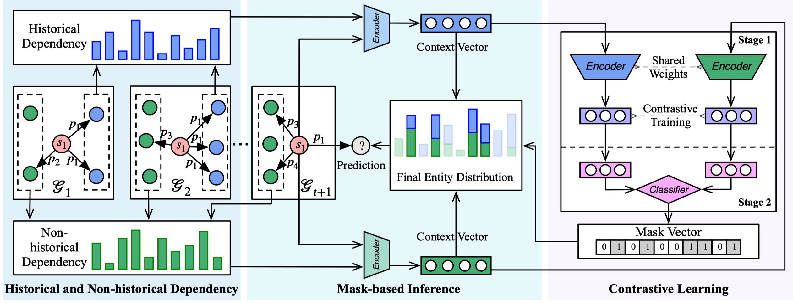
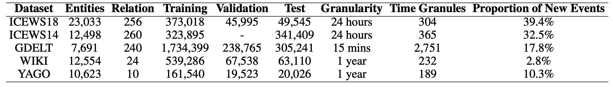

# Optimized CENET for Candidate-Level History Validity Correction

This repository folder is a reviewer-facing CENET package for the paper **Learning Candidate-Level History Validity Correction for Temporal Knowledge Graph Forecasting**.

It contains the upstream CENET implementation plus additional scripts/modules for:

- CENET backbone score dumping,
- Exact Recency Heuristic,
- RHVC diagnostic prototype,
- HVA dual-branch,
- HVA exact-only final method.

See `README_HVA_CENET.md` and `docs/CENET_HVA_PROTOCOL.md` for the paper-specific reproduction protocol.

---

## Upstream CENET README

# CENET: Contrastive Event Network

This is the official code base of the paper

[Temporal Knowledge Graph Reasoning with Historical Contrastive Learning](https://arxiv.org/abs/2211.10904)



## Statistics of Datasets



## Preprocessing
```bash
cd data/YAGO
python get_history_graph.py
```

## Training and Testing
```bash
python main.py -d YAGO --description yago_hard --max-epochs 30 --oracle-epochs 20 --valid-epochs 5 --alpha 0.2 --lambdax 2 --batch-size 1024 --lr 0.001 --oracle_lr 0.001 --oracle_mode hard --save_dir SAVE --eva_dir SAVE
```

Note that we use hard mode for YAGO and WIKI, soft mode for event-based TKGs. The model performance fluctuates by less than 1% under different seed settings. For example, you will get better performance than the paper results under the setting of Seed 987.


You can use function *load_all_answers_for_time_filter* and *split_by_time* in [script](https://github.com/Lee-zix/RE-GCN/blob/master/rgcn/utils.py) implemented by RE-GCN to get the time-aware filtered results.

## Citation ##

If you find this project useful in your research, please cite the following paper:

```bibtex
@inproceedings{xu-etal-2023-cenet,
  title = {Temporal Knowledge Graph Reasoning with Historical Contrastive Learning},
  author = "Xu, Yi and Ou, Junjie and Xu, Hui and Fu, Luoyi",
  booktitle = "AAAI",
  year = "2023"
}
```
